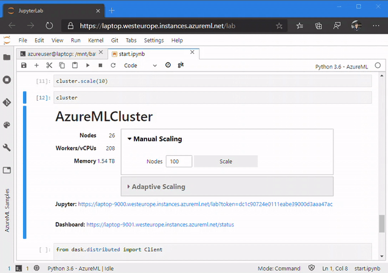

forked from https://github.com/danielsc/azureml-and-dask

# Azure ML and Dask 


## Introduction

Dask + Azure ML = OSS Data Science & ML @ Scale.

### This repo
This is an informal collection of demos around Dask on Azure ML. I do not know how to write code. People who may know how to write code are writing code [here](https://github.com/drabastomek/dask-cloudprovider) which will soon provide `AzureMLCluster` in `dask_cloudprovider`, simplifying much of the setup you'll see today. 

```python
from azureml.core import Workspace
from dask_cloudprovider import AzureMLCluster

ws  = Workspace.from_config()
ct  = ws.compute_targets['dask-ct']
env = ws.environments['dask-env']

cluster = AzureMLCluster(ws, ct, env)
```



You can follow the link to view the Dask dashboard. You can also use an interactive JupyterLab session on the cluster, with all or some mountable Azure ML Datastores from your Workspace available on the headnode via standard POSIX file system. You can manage the Azure ML Environment, including base docker image and conda/pip packages, which will be used on the cluster. Clusters can be created on most Azure ML VM sizes, including commodity CPU machines for large distributed clusters or high-performance GPU machines for acceleration.

Alternatively, you can use the cluster in a normal Dask Client.

```python
from dask.distributed import Client

c = Client(cluster)
```

**Warning**: Currently, the demos in this repository will not run as-is. Please follow the instructions below to use the demos in this repo with little to no modification.

**Warning**: With default subscription quotas, you may not be able to run the notebook as-is. Check your subscription's quota in the region and calculate the maximum size cluster you can use. The default cluster created in this notebook is about the minimum needed to work with the data very quickly without repartitioning, but smaller clusters will work.

### Data overview

The data is a copy of the [NOAA Integrated Surface Data (ISD)](https://azure.microsoft.com/services/open-datasets/catalog/noaa-integrated-surface-data/) moved from [Azure Open Datasets](https://azure.microsoft.com/services/open-datasets/catalog/) to an ADLS Gen 2 filesystem for distributed processing. 

The data is stored in both compressed parquet files and uncompressed CSV files which are ~8 GB and ~150 GB respectively. There are >1000 individual files. Loaded in a dataframe, the data is ~750 GB. There are ~1.4 B rows.

## Prerequisites

* [Azure Machine Learning Workspace](https://aka.ms/azureml/workspace)
* [Azure Machine Learning Compute Target](https://aka.ms/azureml/computetarget) - see `startcluster-cpu.ipynb`
* [Azure Machine Learning Environment](https://aka.ms/azureml/environments) with required packages - see `startcluster-cpu.ipynb`

Optional setup for `quickdemo-cpu.ipynb` follows.

### Create an ADLSv2 account

Create or use an existing ADLSv2 account. Create a filesystem, and register it as an Azure ML BlobDatastore with the account key (using the studio is recommended).

### Create a virtual network 

Create or use an existing virtual network (vNET). Both the interface for the Dask cluster and the cluster itself will be in the virtual network. You can quickly create one in the [Azure Portal](https://docs.microsoft.com/en-us/azure/virtual-network/quick-create-portal) or [Azure CLI](https://docs.microsoft.com/en-us/azure/virtual-network/quick-create-cli) if you do not have one already.

### Create and setup compute instance 

Create an Azure ML Compute Instance in the vNET you have created.


### Launch JupyterLab or Jupyter

Launch JupyterLab (recommended) or Jupyter from the list of URIs. 


### Clone repository

You can use the terminal or UI to clone https://github.com/lostmygithubaccount/dasky.git.


